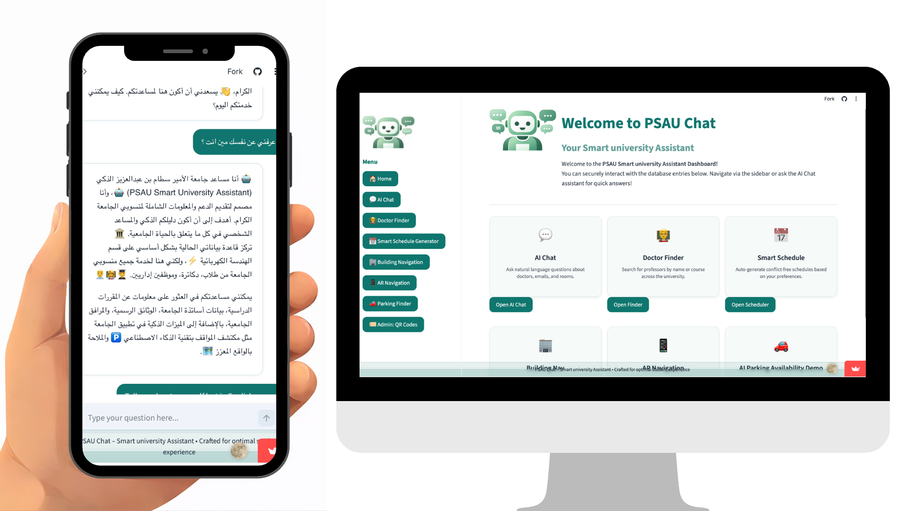
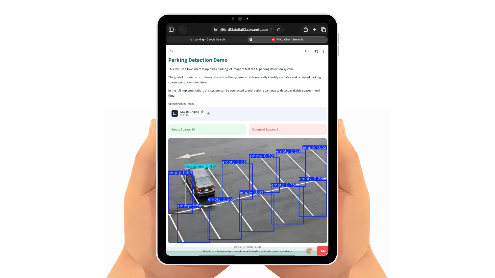

<div align="center">

# 🎓 PSAU Smart University Assistant
### Your All-in-One Intelligent Campus Companion
---


</div>

---

## 🌟 Project Vision
**PSAU Chat** is a state-of-the-art web application developed for **Prince Sattam bin Abdulaziz University (PSAU)**. It leverages AI to bridge the gap between students, faculty, and campus services, providing a seamless, intelligent experience in both Arabic and English.

---

## 🚀 Core Features

<table align="center">
  <tr>
    <td align="center"><b>💬 AI Assistant</b><br>Intelligent billingual chatbot for all your university queries.</td>
    <td align="center"><b>👨‍🏫 Doctor Finder</b><br>Quickly locate professors, emails, and office locations.</td>
  </tr>
  <tr>
    <td align="center"><b>📅 Smart Schedule</b><br>Generate conflict-free academic schedules automatically.</td>
    <td align="center"><b>🏢 Building Navigator</b><br>Smart indoor navigation to every classroom and lab.</td>
  </tr>
  <tr>
    <td align="center"><b>📱 AR Navigation</b><br>Innovative Augmented Reality guidance via QR codes.</td>
    <td align="center"><b>🚗 Parking Finder</b><br>AI-powered parking spot detection for a stress-free arrival.</td>
  </tr>
</table>

---

## 📸 Project Showcase
> [!TIP]
> **To add your screenshots:** 
> 1. Upload your images/videos to an `assets/media` folder.
> 2. Uncomment the image tags below and update the paths.

<!-- <div align="center">
  
  
</div> -->
<div align="center">
  
  
</div>
---

## 📂 Repository Structure
```text
PSAU-CHAT/
├── app.py                 # Core Application Engine
├── LICENSE                # Usage Rights
├── requirements.txt       # Dependencies
├── data/                  # Smart Knowledge Base (Excel)
└── assets/                # Design & Branding Assets
```

---

## 🛠️ Getting Started

### 1️⃣ Clone & Install
```bash
git clone https://github.com/rubajk271-max/PSAU-CHAT.git
pip install -r requirements.txt
```

### 2️⃣ Environment Setup
Create a `.env` file from the provided template:
```bash
cp .env.example .env
# Edit .env with your GEMINI_API_KEY
```

### 3️⃣ Run Locally
```bash
streamlit run app.py
```

---

## 🌍 Deployment (Public Link)
Check out the live version here:
🔗 **[psau-chat.streamlit.app](https://psau-chat-8ckfwzbj9jvrdf3xjp6a83.streamlit.app/)**

---

## 🤝 The Team
*   **Ruba Salman** – Project Lead
*   **Ameera Fahad** – Reviewer & QA
*   **Muneera Abdulrahman** – Core Developer
*   **Nadine Ali** – Logic Programmer
*   **Nora Fahad** – UI/UX Designer

---

<div align="center">
  <p><i>Developed with ❤️ for PSAU Students and Faculty</i></p>
</div>
